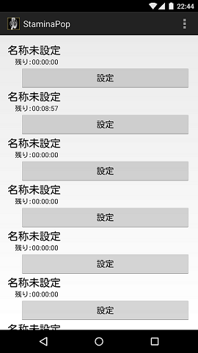
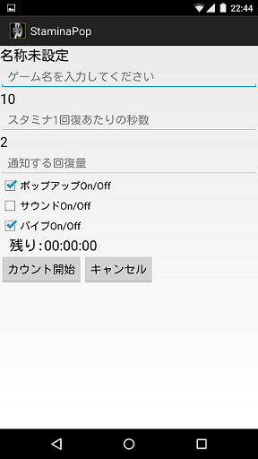

StaminaPop
==
ソーシャルゲームのいわゆるスタミナを決まった時間にお知らせするアプリです。 
いろんなソーシャルゲームを掛け持ちしていて効率を追い求める人向けです。 
ソーシャルゲームごとに時間設定、通知を設定できます。 
各機能の説明 
・ソーシャルゲームごとの設定を行うことができます。 
・名称未設定(名前)：ソーシャルゲームの名前を設定できます。 
・ソーシャルゲームごとのスタミナが1回復できる時間を設定できます。 
・スタミナが設定した量分回復すると通知をする設定にします。 
・カウント開始：ボタンを押した瞬間からカウントを開始します。 
・ポップアップ、サウンド、バイブのOn/Offを設定できます。 
 
GooglePlayストア 
https://play.google.com/store/apps/details?id=jp.ac.teu.st.m0112449.staminapop
